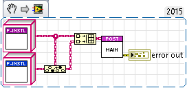

# lv-post-installer

lv-post-installer provides the ability to manage application dependencies post-install. The post installer package can be used to manage (install, un-install, migrate, backup) application dependencies as code. Keep in mind that the post installer is compiled into the application, so it's not possible to load plugins at runtime (feel free to compile it into a lvlibp if you need that functionality).

## Disclaimers

Keep the following in mind:

- The implementation of the post installer is incredibly implementation specific; it WILL create couplings and assumptions in terms of the operating system, security, bitness (x64 or x86) etc. Be sure to take these into account when developing this code.
- There's a lot of opportunity for the chicken before the egg, ensure that you enforce an order of installation through verification and obviously create an installer for the post installer so the labview runtime is at least available.
- When performing installations, sometimes a reboot can be supressed, but won't allow you to "use" the installed application until post reboot, be aware of these and suggest reboots within your documentation

## Getting Started

To get started, implement the lv-post-installer class and provide it as an input for the lv-post-installer interface. From there you can use the manual mode to execute one or more of the methods for post installation.

## lv-post-installer classes

The lv-post-installer class provides a handful of methods that attempt to describe "all" operations for installing application dependencies, not all of these are necessary (or in some cases possible). None of these methods have super useful inputs/outputs; if you need some kind of state management or need to communicate to something else, you'll need to encapsualte it within your methods.

- backup.vi: this can be used to store data to "backup" an existing installation, expected to be used with the migrate method
- download.vi: this can be used to download the installer/files
- identify.vi: this can be used to identify the post installer class/module
- install.vi: this can be used to install the application dependency
- migrate.vi: this can be used to migrate an installation from one version to another, expected to be used with the backup method
- post_install.vi: this is executed after installation
- pre_install.vi: this is executed before installation
- pre_uninstall.vi: this is executed before uninstallation
- re_install.vi: this is an alternate install method in the event it's already installed
- restore.vi: this can be used to "restore" application data (for migration)
- uninstall.vi: this can be used to uninstall an application dependency
- verify.vi: this can be used to verify whether an application dependency is installed

## lv-post-installer interface

This is a proof of concept that can be used to validate post installer class implementations, or used as-is. It will allow you to perform common installation/uninstallation patterns as well as execute each separately. You'll need to load all of the classes you want to use into the interface via terminal.

Installation: verify > download > pre_install > install > post_install > verify
Uninstallation: verify > pre_uninstall > uninstall > post_uninstall > verify

The example shows how you would load classes into the interface.

